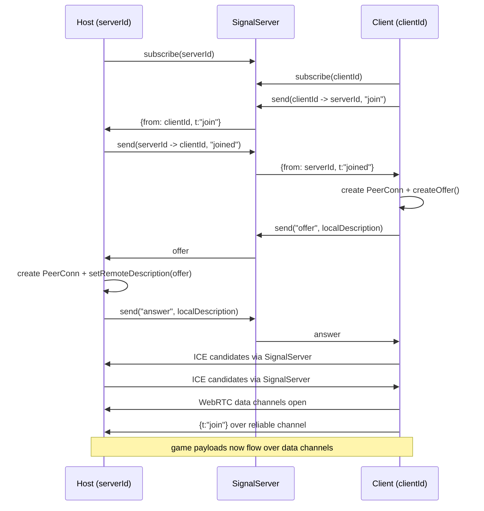
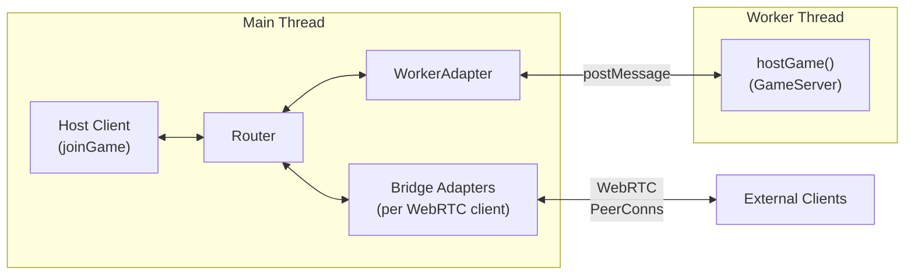

# GameNet Architecture

This document describes the architecture of the `@gamenet/core` library (`packages/gamenet`) and its example apps (`apps/example`, `apps/example-bjs`).

## High-level overview

GameNet provides browser-based peer networking for multiplayer games:

- **Session bootstrap** via a pluggable **signal server** (MQTT or local WebSocket).
- **Peer transport** via **WebRTC RTCPeerConnection**.
- **Game messages** via two data channels:
  - `reliable` (ordered, default reliability)
  - `unreliable` (unordered, `maxRetransmits: 0`)
- **Host/client APIs** exposed by `hostGame()` and `joinGame()`.
- **Web Worker hosting** — the primary hosting model runs the game server in a Web Worker, keeping game logic off the main thread while the main thread handles WebRTC negotiation and message routing.

Signal server selection is the consuming app's responsibility — the library exports `selectSignalServer()` and signal server factories.

## Module map

### Public API

- `index.ts` (`@gamenet/core`)
  - Re-exports `game_server` and `game_client` APIs.
  - Exports signal server factories (`createMqttSignalServer`, `createLocalSignalServer`) and `selectSignalServer()`.
  - Exports routing types and functions (`Adapter`, `Router`, `createRouter`, `createWorkerAdapter`, `createServerWebRTCAdapterManager`, etc.).
  - Exports channel utilities (`createHostChannelId`, `createClientChannelId`).
  - Exports telemetry types (`ClientsPingListPayload`, `ClientsPingListEntry`).
  - Exports serialization (`PayloadSerde`, `createJsonPayloadSerde`, `createMsgpackPayloadSerde`).

### Worker setup API

- `routing/host_server_worker_setup.ts` (`@gamenet/core/worker-setup`)
  - Exports `setupHostServerWorker(workerScope)` — initializes `hostGame()` inside a Web Worker.
  - Exports `HostServerWorkerScope` and `WorkerPostMessage` types for typing worker entry points.
  - Waits for a `__init` control message from the main thread containing the `serverId`, then creates a `WorkerServerAdapterManager` and starts the game server.

### React bindings

- `react/GameContext.tsx` (`@gamenet/core/react`)
  - Provides `GameProvider` component and `useGame` hook for React apps.
  - Manages `GameSession` lifecycle (start/end session, message buffering).

### Core session APIs

- `game_server.ts`
  - Implements `hostGame(args?): Promise<GameServer>`.
  - Accepts optional `createAdapterManager` to inject custom server transport (default: WebRTC).
  - Owns active adapter-backed sessions for connected clients.
  - Converts data channel messages into typed events (via `mitt`).
  - Emits per-client `Channel` objects to game code.
- `game_client.ts`
  - Implements `joinGame(args)`.
  - Accepts optional `createAdapterSession` to inject custom client transport (default: WebRTC).
  - Creates local client id and starts adapter-backed join flow.
  - Emits inbound game events via `mitt`.
  - Supports optional synthetic latency (`extraLatency`) in both directions.

### IDs and channel naming

- `channel.ts`
  - `createHostChannelId()` produces a short numeric host code plus hash suffix.
  - `createClientChannelId()` uses `nanoid(21)`.

### WebRTC connection primitive

- `peer_conn.ts`
  - Wraps `RTCPeerConnection` setup.
  - Handles SDP offer/answer and ICE candidate exchange through a signaling adapter.
  - Creates and tracks `reliable` + `unreliable` data channels.
  - Exposes `sendJSON` and `sendRaw` with reliability selection.

### Signaling abstraction and implementations

- `signal_server.ts`
  - Defines `SignalServer` interface (`send`, `subscribe`, `unsubscribe`).
  - Maintains global selected implementation (`getSignalServer` / `selectSignalServer`).
- `signal_server_mqtt.ts`
  - MQTT-backed signaling using topic-per-recipient.
  - Default topic prefix: `pjoe.gamenet/`.
- `signal_server_local.ts`
  - Browser-side local WebSocket signaling client.
- `signal_server_local_server.ts`
  - Node/WebSocket reference signaling server for local development.

### Routing submodule

`packages/gamenet/src/routing/*` defines a generic in-process routing model with pluggable transport adapters:

- `message.ts`: binary message shape (`ArrayBuffer`, `reliable` flag).
- `client.ts`: generic message endpoint (`Client`).
- `adapter.ts`: adapter abstraction + transport-agnostic session contracts (`ClientAdapterSession`, `ServerAdapterSession`, `ServerAdapterManager`).
- `worker_adapter.ts`: main-thread `createWorkerAdapter` + worker-side `createWorkerServerAdapterManager`.
- `adapter_webrtc.ts`: WebRTC adapter + client/server session/manager implementations.
- `envelope_payload.ts`: `decodeRoutingEnvelopePayload` for transparent routing payload unwrapping on client side.
- `router.ts`: route table + adapter/client registration and forwarding.
- `host_server_worker_setup.ts`: setup function exported as `@gamenet/core/worker-setup` for apps to create worker entry points.

**Integration status**:

- Routing infrastructure is wired into `hostGame` and `joinGame` runtime
- Each `GameServer` creates a `Router` and registers adapters per connected peer
- Each `GameClient` creates a `Router` and registers an adapter for server connection
- `apps/example/src/pages/Host.tsx` implements the full worker-hosted topology: game server in worker, local host-client, and external WebRTC clients bridged through the main-thread router
- Routing messages coexist with existing non-routing messages on data channels
- Routing types and functions are exported from `@gamenet/core`

See `docs/routing.md` for detailed flow diagrams and the worker-hosted architecture.

### Experimental / unused

- `msgpack.ts` is commented-out prototype code for MessagePack extension codecs.

## Host/client connection flow



## Runtime responsibilities

### Host side (`GameServer`)

- Creates a `Router` instance for message routing.
- Delegates signaling + negotiation + data-channel lifecycle to a pluggable `ServerAdapterManager` (default: WebRTC; can be injected via `createAdapterManager` arg).
- For each connected session:
  - registers session adapter with router,
  - tracks session + adapter by remote client id,
  - bridges non-routing envelopes to `mitt` events.
- Creates a per-client `Channel` abstraction with:
  - `on(type|"*")`
  - `emit(...)` / `emitRaw(...)`
  - `onDisconnect(...)`
- Sends periodic pings every 500 ms and maintains smoothed latency estimate.
- Cleans up adapter routes on peer disconnect.

### Worker-hosted server (`Host.tsx` + worker entry)

The primary hosting model runs `hostGame()` inside a Web Worker, keeping game logic off the main thread. Both `apps/example` and `apps/example-bjs` use this topology.

#### Three-component topology



#### Startup sequence

1. Main thread creates `serverId` via `createHostChannelId()` and a `Router` instance.
2. Web Worker is spawned (`new Worker("host_server_worker.ts", { type: "module" })`).
3. A `WorkerAdapter` is created via `createWorkerAdapter(id, worker)` and registered with the router, targeting a well-known `WORKER_SERVER_ID`.
4. A `__init` control message is sent to the worker containing the `serverId`.
5. The worker's `setupHostServerWorker()` receives `__init`, creates a `WorkerServerAdapterManager`, and calls `hostGame()` — returning a `GameServer` the app can hook into.
6. The host tab joins its own game via `joinGame()` with a local adapter session (no WebRTC needed).
7. A `ServerWebRTCAdapterManager` is created on the main thread to accept external WebRTC clients.

#### Worker adapter communication

The `WorkerAdapter` bridges the main-thread `Router` and the worker via `postMessage`:

- **Main → Worker**: `router.sendMessage()` → `workerAdapter.receiveMessage()` → `worker.postMessage(message, [message.data])` (zero-copy `ArrayBuffer` transfer).
- **Worker → Main**: worker's `postMessage(message, [message.data])` → `worker.onmessage` → `adapter.emitMessage()` → router routes onward.

All `ArrayBuffer` payloads are transferred with zero-copy semantics using the transferable list.

#### Control message protocol

The worker adapter manager uses reserved message types for session lifecycle:

- `__init` — sent once at startup, carries `serverId` so the worker can initialize `hostGame()`.
- `__client_connected` — sent when a new client (local or external) connects; carries client id and nickname.
- `__client_disconnected` — sent when a client disconnects; triggers session cleanup in the worker.

Regular game messages flow alongside control messages using the standard `Message` struct.

#### Local host client

The host browser tab joins its own game via `joinGame()` with a custom `createLocalClientAdapterSession` — a purely in-process adapter that routes through the main-thread `Router` without any WebRTC connection. Messages pass directly from the host client adapter through the router to the worker adapter and back.

#### External WebRTC client bridging

External clients connect via WebRTC to a `ServerWebRTCAdapterManager` on the main thread. For each connected external client, a "bridge adapter" is created and registered with the router. The bridge adapter:

- **Inbound**: receives WebRTC data channel messages from the client, wraps them as `Message` structs, and sends them through the router to the worker.
- **Outbound**: receives `Message` structs from the router (originating in the worker) and forwards them over the client's WebRTC data channels.

The worker broadcasts `clients_ping_list` to all connected sessions (both local and external).

#### Creating a worker entry point

Apps provide their own worker entry point that imports `setupHostServerWorker` from `@gamenet/core/worker-setup`:

```typescript
import {
  setupHostServerWorker,
  type HostServerWorkerScope,
} from "@gamenet/core/worker-setup";

const workerScope = self as unknown as HostServerWorkerScope;
const server = await setupHostServerWorker(workerScope);

server.onConnection = (channel) => {
  channel.emit("msg", "Welcome to the server!");
};
```

See `docs/routing.md` for detailed architecture diagrams and message flows.

### Client side (`GameClient`)

- Creates a `Router` instance for message routing.
- Delegates signaling + negotiation + data-channel lifecycle to a pluggable `ClientAdapterSession` (default: WebRTC; can be injected via `createAdapterSession` arg).
- On connect:
  - creates adapter from session and registers it with router,
  - sends reliable `{t:"join"}` event,
  - auto-responds to host `ping` with `pong`.
- Incoming messages pass through `decodeRoutingEnvelopePayload` to transparently unwrap routing payloads.
- Cleans up adapter on disconnect.

## Data and event model

Game payloads are sent over data channels:

- **Standard messages**: `{ t: string, data: unknown }` (JSON envelopes)
  - Parsed and emitted through `mitt` under event name `t`
- **Routing messages**: binary msgpack-encoded frames sent via `sendRaw`
  - Contain `from`, `to`, `type`, `reliable`, and `data` (as `Uint8Array`)
  - Routed through `WebRTCAdapter` to `Router`
  - Compatible with existing message flow (both types coexist on the same data channels)

Wildcard handlers (`"*"`) are supported on both host `Channel` and client `GameClient`.

## Extension points

1. **Signal transport**: implement `SignalServer` and call `selectSignalServer(...)`.
2. **Message encoding**: replace JSON envelopes with binary codecs (see `msgpack.ts` prototype).
3. **ICE config**: extend `iceServers` in `peer_conn.ts` for NAT traversal.
4. **Custom adapter sessions**: inject `createAdapterSession` into `joinGame()` or `createAdapterManager` into `hostGame()` for non-WebRTC transports.
5. **Worker-hosted server**: use `setupHostServerWorker` from `@gamenet/core/worker-setup` to run game logic in a Web Worker, with the main thread handling WebRTC negotiation and routing.

## Notable implementation characteristics

- Signal server can be injected into adapter sessions, with global selected server used by default.
- Two-channel design allows reliability tradeoffs per message.
- `extraLatency` is a useful deterministic network simulation hook on client side.
- Host ping interval is created per connection and cleared on disconnect.
- Routing types and functions are exported from `@gamenet/core` for app-level use.
- Routing and non-routing messages coexist on same data channels without interference.
- `hostGame()` and `joinGame()` accept optional factory args for adapter managers/sessions, enabling non-WebRTC transports (e.g., worker-backed local sessions).
- The worker-hosted model keeps game logic off the main thread while the main thread handles WebRTC negotiation and message routing.

## File index

### Library (`packages/gamenet/src/`)

- `index.ts` — public API entry (`@gamenet/core`)
- `channel.ts`
- `game_client.ts`
- `game_server.ts`
- `peer_conn.ts`
- `serde.ts`
- `clients_ping_list.ts`
- `signal_server.ts`
- `signal_server_mqtt.ts`
- `signal_server_local.ts`
- `signal_server_local_server.ts`
- `react/GameContext.tsx` — React bindings (`@gamenet/core/react`)
- `routing/message.ts`
- `routing/client.ts`
- `routing/adapter.ts`
- `routing/worker_adapter.ts`
- `routing/adapter_webrtc.ts`
- `routing/envelope_payload.ts`
- `routing/router.ts`
- `routing/host_server_worker_setup.ts` — worker setup (`@gamenet/core/worker-setup`)
- `routing/host_server_worker.ts`
- `msgpack.ts`

### Example app (`apps/example/src/`)

- `main.tsx` — app entry, signal server initialization
- `App.tsx` — router shell
- `pages/Home.tsx`
- `pages/Host.tsx` — worker-hosted server orchestrator
- `pages/Join.tsx`
- `pages/Game.tsx`
- `workers/host_server_worker.ts` — worker entry point (uses `@gamenet/core/worker-setup`)

### Babylon.js example app (`apps/example-bjs/src/`)

- `main.tsx` — app entry, signal server initialization
- `App.tsx` — router shell
- `pages/Host.tsx` — worker-hosted server orchestrator (same pattern as `apps/example`)
- `pages/Join.tsx`, `pages/Game.tsx`, `pages/Home.tsx`
- `workers/host_server_worker.ts` — worker entry point with Babylon.js server setup
- `game/` — game logic (scene, player, netsync, serde)
- `components/` — Babylon.js scene and sidebar UI
