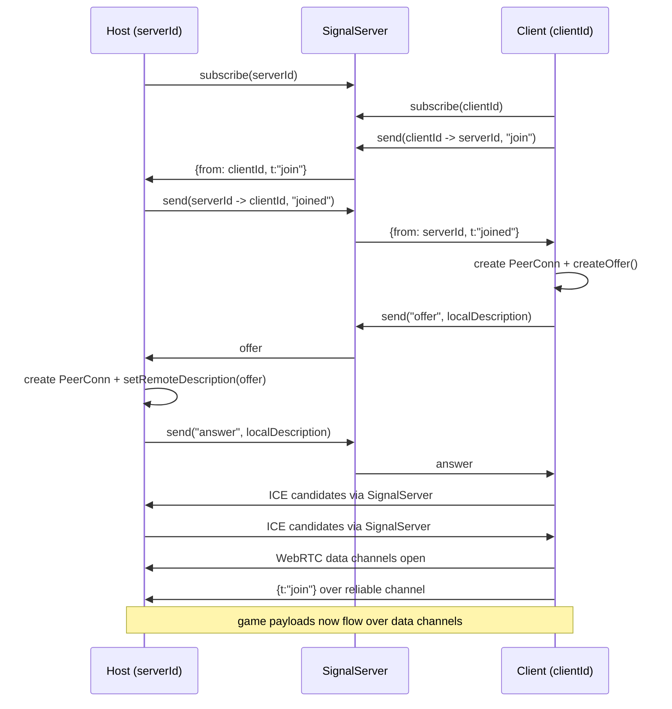

# GameNet Architecture

This document describes the architecture implemented in `src/gamenet`.

## High-level overview

GameNet provides browser-based peer networking for multiplayer games:

- **Session bootstrap** via a pluggable **signal server** (MQTT or local WebSocket).
- **Peer transport** via **WebRTC RTCPeerConnection**.
- **Game messages** via two data channels:
  - `reliable` (ordered, default reliability)
  - `unreliable` (unordered, `maxRetransmits: 0`)
- **Host/client APIs** exposed by `hostGame()` and `joinGame()`.

At startup, `src/gamenet/index.ts` selects a default signal server implementation.

## Module map

### Public API

- `index.ts`
  - Re-exports `game_server` and `game_client` APIs.
  - Picks default signaling backend using `selectSignalServer(...)`.

### Core session APIs

- `game_server.ts`
  - Implements `hostGame(): Promise<GameServer>`.
  - Owns active `PeerConn`s for connected clients.
  - Converts data channel messages into typed events (via `mitt`).
  - Emits per-client `Channel` objects to game code.
- `game_client.ts`
  - Implements `joinGame({ serverId, extraLatency })`.
  - Creates local client id and drives join + offer flow.
  - Emits inbound game events via `mitt`.
  - Supports optional synthetic latency (`extraLatency`) in both directions.

### IDs and channel naming

- `channel.ts`
  - `createHostChannelId()` produces a short numeric host code plus hash suffix.
  - `createClientChannelId()` uses `nanoid(21)`.

### WebRTC connection primitive

- `peer_conn.ts`
  - Wraps `RTCPeerConnection` setup.
  - Handles SDP offer/answer and ICE candidate exchange through a signaling adapter.
  - Creates and tracks `reliable` + `unreliable` data channels.
  - Exposes `sendJSON` and `sendRaw` with reliability selection.

### Signaling abstraction and implementations

- `signal_server.ts`
  - Defines `SignalServer` interface (`send`, `subscribe`, `unsubscribe`).
  - Maintains global selected implementation (`getSignalServer` / `selectSignalServer`).
- `signal_server_mqtt.ts`
  - MQTT-backed signaling using topic-per-recipient.
  - Default topic prefix: `pjoe.gamenet/`.
- `signal_server_local.ts`
  - Browser-side local WebSocket signaling client.
- `signal_server_local_server.ts`
  - Node/WebSocket reference signaling server for local development.

### Routing submodule integration

`src/gamenet/routing/*` defines a generic in-process routing model:

- `client.ts`: generic message endpoint (`Client`).
- `adapter.ts`: adapter abstraction (can wrap workers).
- `adapter_webrtc.ts`: WebRTC adapter for remote peer communication (internal, not publicly exported).
- `router.ts`: route table + adapter/client registration and forwarding.
- `message.ts`: binary message shape (`ArrayBuffer`, `reliable` flag).

**Integration status**: 
- Routing infrastructure is now wired into `hostGame` and `joinGame` runtime
- Each `GameServer` creates a `Router` and `WebRTCAdapter` per connected peer
- Each `GameClient` creates a `Router` and `WebRTCAdapter` for server connection
- Routing messages coexist with existing non-routing messages on data channels
- **Not exported**: Routing API is internal and not exposed from `src/gamenet/index.ts`

### Experimental / unused

- `msgpack.ts` is commented-out prototype code for MessagePack extension codecs.

## Host/client connection flow

## Runtime responsibilities

### Host side (`GameServer`)

- Subscribes on `serverId` signaling topic/channel.
- Creates a `Router` instance for message routing.
- For each joiner:
  - responds `joined`,
  - creates a `PeerConn` on offer,
  - creates a `WebRTCAdapter` and registers it with router,
  - tracks connection in `peerConns`, `dcMap`, and `adapters`.
- Creates a per-client `Channel` abstraction with:
  - `on(type|"*")`
  - `emit(...)` / `emitRaw(...)`
  - `onDisconnect(...)`
- Sends periodic pings every 500 ms and maintains smoothed latency estimate.
- Data channel handlers check for routing messages and pass them to adapter.
- Cleans up adapter routes on peer disconnect.

### Client side (`GameClient`)

- Subscribes on generated `clientId` signaling channel.
- Creates a `Router` instance for message routing.
- Sends initial `join` to `serverId`.
- On `joined`, creates offer and completes negotiation.
- On connect:
  - creates a `WebRTCAdapter` and registers it with router,
  - unsubscribes from signaling,
  - binds data channel handlers (with routing support),
  - sends reliable `{t:"join"}` event,
  - auto-responds to host `ping` with `pong`.
- Cleans up adapter on disconnect.

## Data and event model

Game payloads are sent as JSON envelopes over data channels:

- **Standard messages**: `{ t: string, data: unknown }`
  - Parsed and emitted through `mitt` under event name `t`
- **Routing messages**: `{ t: string, data: { from: string, to: string, payload: string } }`
  - Detected by structure and routed through `WebRTCAdapter` to `Router`
  - Payload is base64-encoded ArrayBuffer
  - Compatible with existing message flow (both types coexist)

Wildcard handlers (`"*"`) are supported on both host `Channel` and client `GameClient`.

## Extension points

1. **Signal transport**: implement `SignalServer` and call `selectSignalServer(...)`.
2. **Message encoding**: replace JSON envelopes with binary codecs (see `msgpack.ts` prototype).
3. **Routing API exposure**: export routing module from `src/gamenet/index.ts` when ready for public use.
4. **ICE config**: extend `iceServers` in `peer_conn.ts` for NAT traversal.

## Notable implementation characteristics

- Signal server is selected globally (singleton-style) rather than per session.
- Two-channel design allows reliability tradeoffs per message.
- `extraLatency` is a useful deterministic network simulation hook on client side.
- Host ping interval is created per connection and not currently cleared on disconnect/dispose.
- Routing infrastructure is wired internally but not exposed in public API.
- Routing and non-routing messages coexist on same data channels without interference.

## File index

- `src/gamenet/index.ts`
- `src/gamenet/channel.ts`
- `src/gamenet/game_client.ts`
- `src/gamenet/game_server.ts`
- `src/gamenet/peer_conn.ts`
- `src/gamenet/signal_server.ts`
- `src/gamenet/signal_server_mqtt.ts`
- `src/gamenet/signal_server_local.ts`
- `src/gamenet/signal_server_local_server.ts`
- `src/gamenet/routing/client.ts`
- `src/gamenet/routing/adapter.ts`
- `src/gamenet/routing/adapter_webrtc.ts` (internal, not exported)
- `src/gamenet/routing/router.ts`
- `src/gamenet/routing/message.ts`
- `src/gamenet/msgpack.ts`
- `src/gamenet/signal_server_local.ts`
- `src/gamenet/signal_server_local_server.ts`
- `src/gamenet/routing/client.ts`
- `src/gamenet/routing/adapter.ts`
- `src/gamenet/routing/router.ts`
- `src/gamenet/routing/message.ts`
- `src/gamenet/msgpack.ts`
