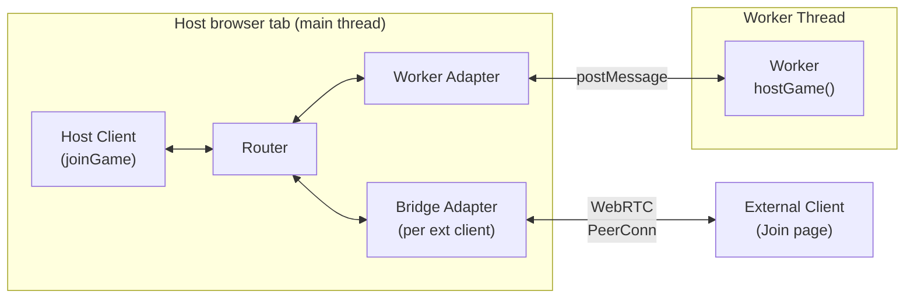
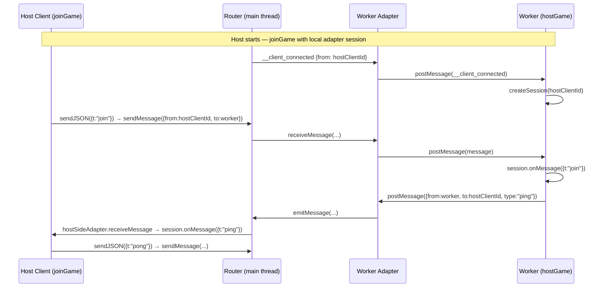
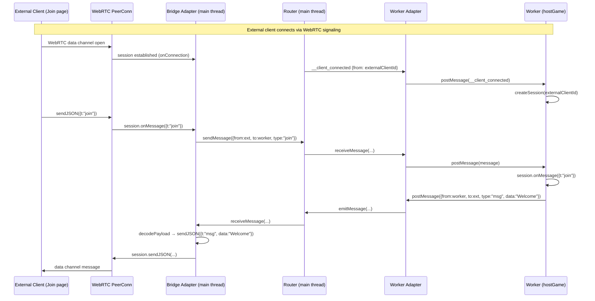
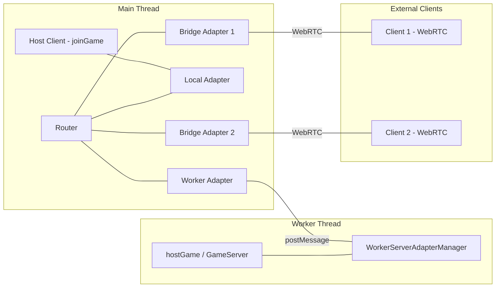
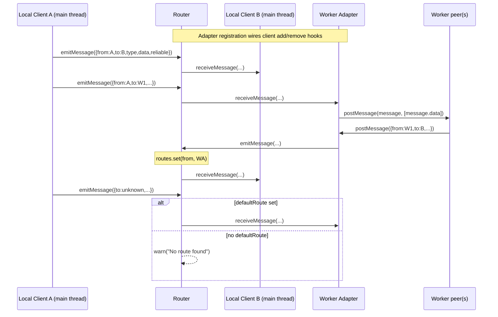
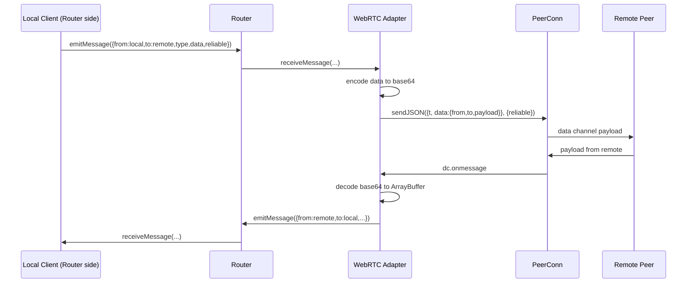

# Routing Architecture

This document describes the routing subsystem in `src/gamenet/routing` and how messages flow between peers across local, worker, and remote (WebRTC) boundaries.

## Status at a glance

- **Implemented**:
  - In-process router with direct local clients
  - Worker adapter for web worker communication
  - Worker-side `ServerAdapterManager` (`createWorkerServerAdapterManager`)
  - WebRTC adapter for remote peer communication (internal, not publicly exported)
  - Worker-hosted game server with local host-client and external WebRTC clients (`Host.tsx`)
  - `envelope_payload.ts` for decoding routing payloads on the client side
- **Integration status**: WebRTC adapter is wired into `game_server.ts` and `game_client.ts` runtime; worker hosting is wired in `Host.tsx` and `host_server_worker.ts`; routing API is not exported from `src/gamenet/index.ts`

## Core module map

- `message.ts`
  - Defines `Message`:
    - `from: string`
    - `to: string`
    - `type: string`
    - `data: ArrayBuffer`
    - `reliable: boolean`
- `client.ts`
  - Defines `Client` with `receiveMessage(...)` and `emitMessage(...)` hooks.
  - `createClient(id)` builds a simple in-process endpoint.
- `adapter.ts`
  - Defines `Adapter` (`Client` + `clientIds` + client lifecycle hooks).
  - Defines transport-agnostic session contracts:
    - `ClientAdapterSession` — used by `joinGame()` to abstract client-side transport.
    - `ServerAdapterSession` / `ServerAdapterManager` — used by `hostGame()` to abstract server-side transport.
  - Re-exports worker adapter utilities from `worker_adapter.ts`.
- `worker_adapter.ts`
  - `createWorkerAdapter(id, worker)` — main-thread side; bridges router messages to a `Worker` via `postMessage` (with transferable `ArrayBuffer`).
  - `createWorkerServerAdapterManager(args)` — worker-thread side; creates a `ServerAdapterManager` that runs inside a Web Worker, dispatching control messages (`__client_connected`, `__client_disconnected`) and game messages to per-client sessions.
- `adapter_webrtc.ts`
  - `createWebRTCAdapter(id, remoteId, sendJSON)` bridges routing messages to/from WebRTC data channels.
  - `handleIncomingWebRTCMessage(adapter, envelope, reliable)` processes inbound WebRTC messages.
  - `createClientWebRTCAdapterSession(args)` — full WebRTC client session lifecycle (signaling, PeerConn, adapter creation).
  - `createServerWebRTCAdapterManager(args)` — full WebRTC server manager lifecycle (signaling, PeerConn per client, adapter creation).
  - **Internal use only**: Not exported from `src/gamenet/index.ts`.
- `envelope_payload.ts`
  - `decodeRoutingEnvelopePayload(data)` — detects and decodes base64-encoded routing payloads in message envelopes; used by `game_client.ts` to transparently unwrap routed messages.
- `host_server_worker.ts`
  - Worker entry point that runs `hostGame()` inside a Web Worker using `createWorkerServerAdapterManager`.
  - Handles `__init` control message to bootstrap, then dispatches all subsequent messages to the adapter manager.
  - Runs game logic (connection handling, `clients_ping_list` broadcast) inside the worker thread.
- `router.ts`
  - Defines `Router` and `createRouter(id)`.
  - Maintains:
    - `adapters: Map<string, Adapter>`
    - `routes: Map<string, Client>` (client id → direct client or adapter)
    - optional `defaultRoute`.

## Routing primitives

### 1) Local peers in the same thread (direct clients)

Local peers are registered directly with `registerClient(client)`.

- Router stores `routes.set(client.id, client)`.
- When a client emits (`client.onEmitMessage`), router calls `sendMessage(message)`.
- If `message.to` exists in `routes`, router forwards to that target's `receiveMessage(...)`.
- If no route exists, router forwards to `defaultRoute` if configured; otherwise logs a warning.

### 2) Local peers in a web worker (worker adapter)

Worker-hosted peers are represented through an adapter registered with `registerAdapter(adapter)`.

- Adapter route population:
  - Existing `adapter.clientIds` are inserted into router routes at registration time.
  - `adapter.onClientAdd` and `adapter.onClientRemove` keep route table in sync.
- Router-to-worker direction:
  - Router resolves destination to the worker adapter and calls `adapter.receiveMessage(message)`.
  - `createWorkerAdapter` posts to worker with `worker.postMessage(message, [message.data])`.
- Worker-to-router direction:
  - Worker calls `postMessage(message)` back to main thread.
  - Adapter `worker.onmessage` converts event data to `Message` and calls `adapter.emitMessage(message)`.
  - Router listens to `adapter.onEmitMessage`, updates source route (`message.from -> adapter`), then routes onward.

### 3) Remote peers via WebRTC

The WebRTC adapter (`adapter_webrtc.ts`) bridges the routing subsystem with WebRTC data channels.

**Outbound routing Message → WebRTC**:

- Routing `Message.type` maps to data-channel envelope field `t`
- `Message.data` (ArrayBuffer) is encoded to base64 for JSON transport
- `Message.reliable` selects between reliable/unreliable data channels
- Envelope structure: `{ t: message.type, data: { from, to, payload: base64 } }`

**Inbound WebRTC → routing Message**:

- Envelope `t` becomes `Message.type`
- Base64 `payload` decoded back to ArrayBuffer
- `from` and `to` preserved from envelope
- Channel type (reliable/unreliable) recorded in `Message.reliable`
- Non-routing messages (without routing envelope structure) are ignored

## Worker-hosted game server (primary hosting model)

The primary hosting topology runs the game server inside a Web Worker, with the host browser tab acting as both the routing hub and a local game client. External players connect via WebRTC. This is implemented in `Host.tsx` and `host_server_worker.ts`.

### Architecture overview

### Components

| Component              | Location             | Role                                                                                                          |
| ---------------------- | -------------------- | ------------------------------------------------------------------------------------------------------------- |
| **Router**             | Main thread          | Central message hub; routes between worker adapter, local host-client adapter, and per-client bridge adapters |
| **Worker Adapter**     | Main thread → Worker | Bridges `postMessage` between main-thread router and worker thread                                            |
| **Worker Game Server** | Worker thread        | Runs `hostGame()` with `createWorkerServerAdapterManager`; handles game logic                                 |
| **Host Client**        | Main thread          | Regular `joinGame()` client connected locally via `createLocalClientAdapterSession`                           |
| **Bridge Adapter**     | Main thread          | Per-external-client adapter; converts between routing `Message` and WebRTC session `sendJSON`/`sendRaw`       |
| **WebRTC Manager**     | Main thread          | `createServerWebRTCAdapterManager` accepting external peer connections via signaling                          |

### Startup sequence

1. `Host.tsx` creates a `serverId` and a main-thread `Router`.
2. A Web Worker is spawned running `host_server_worker.ts`.
3. A `WorkerAdapter` is created and registered with the router (route target: `WORKER_SERVER_ID`).
4. An `__init` control message is sent to the worker with the `serverId`.
5. Inside the worker, `createWorkerServerAdapterManager` is initialized, and `hostGame()` starts with it.
6. The host tab calls `joinGame()` with `createLocalClientAdapterSession`, connecting the host as a regular game client through the router (no WebRTC needed).
7. A `ServerWebRTCAdapterManager` is created on the main thread to accept incoming WebRTC connections from external clients.

### Control messages

The worker adapter protocol uses special message types for session lifecycle:

| Message type            | Direction     | Purpose                                                         |
| ----------------------- | ------------- | --------------------------------------------------------------- |
| `__init`                | Main → Worker | Bootstrap: passes `serverId`, triggers `hostGame()` in worker   |
| `__client_connected`    | Main → Worker | Notifies worker that a client (local or external) has connected |
| `__client_disconnected` | Main → Worker | Notifies worker that a client has disconnected                  |

### Local host-client flow

The host browser tab joins its own game as a regular client via `joinGame()`. Instead of using WebRTC, it uses `createLocalClientAdapterSession` which routes messages directly through the main-thread router to the worker.

The local host-client adapter (`createLocalClientAdapterSession`) works as follows:

- Registers a **host-side adapter** with the host router that receives messages destined for the host client and delivers them to `session.onMessage`.
- Returns a **client-side adapter** to `joinGame()` for its internal router registration.
- `sendJSON` / `sendRaw` encode the envelope into a routing `Message` and call `hostRouter.sendMessage(...)` directly (no serialization overhead beyond JSON-to-ArrayBuffer encoding).
- On `dispose`, sends `__client_disconnected` to the worker and removes routes.

### External client flow

External clients connect via WebRTC. The main thread acts as a bridge, forwarding messages between the WebRTC session and the worker via the router.

The bridge adapter (`createClientBridgeAdapter` in `Host.tsx`) works as follows:

- Created per external client when `ServerWebRTCAdapterManager.onConnection` fires.
- `receiveMessage` decodes the routing `Message.data` back to JSON and forwards via the WebRTC session's `sendJSON` / `sendRaw`.
- Incoming WebRTC messages from `session.onMessage` are encoded into routing `Message` format and sent to the router via `router.sendMessage(...)`.
- On disconnect, the bridge adapter and routes are cleaned up, and `__client_disconnected` is sent to the worker.

### Combined topology diagram

## Direct WebRTC hosting (without worker)

When `hostGame()` is called directly (without a worker), the game server runs on the main thread with simpler routing:

- `GameServer` creates a `Router` and `ServerWebRTCAdapterManager`.
- Each WebRTC client gets a `WebRTCAdapter` registered with the router.
- Data channel handlers use `handleIncomingWebRTCMessage` for routing messages.
- Non-routing messages are dispatched via `mitt` events as before.

## Client-side routing (`game_client.ts`)

- `joinGame()` creates a `Router` and registers a local `Client` for the client's own ID.
- Connects to the server via `ClientAdapterSession` (WebRTC by default, or custom via `createAdapterSession` arg).
- On connect, the session's adapter is registered with the router.
- Incoming messages pass through `decodeRoutingEnvelopePayload` to transparently unwrap routing payloads before emitting to `mitt`.
- Adapter cleanup on disconnect removes routes.

## Primitives flow diagram (same-thread + worker)

## Primitives flow diagram (WebRTC adapter)

## Routing decisions and guarantees

- Routing key is destination id (`message.to`).
- Source learning exists for adapters (`message.from` is bound to emitting adapter).
- Reliability is part of the message contract (`reliable: boolean`) and remains explicit through WebRTC transport.
- Router itself does not serialize payloads; transport adapters own wire-format translation.
- WebRTC adapter uses base64 encoding for ArrayBuffer transport over JSON-based channels.
- Worker adapter uses `postMessage` with transferable `ArrayBuffer` (zero-copy).

## Compatibility

- Existing non-routing `{ t, data }` messages continue to work unchanged
- Routing messages use extended envelope: `{ t, data: { from, to, payload } }`
- Detection is structure-based: checks for `from`, `to`, `payload` fields in `data`
- `decodeRoutingEnvelopePayload` on the client side transparently unwraps routing payloads
- No signaling protocol changes required
- Backward compatible with existing game code

## Extension points

1. Add new `Adapter` implementations for other transport mechanisms.
2. Use `defaultRoute` as an upstream fallback for unresolved destinations.
3. Add policy checks (authorization, filtering, metrics) at adapter boundaries before forwarding.
4. Export routing API from `src/gamenet/index.ts` when ready for external use.
5. Replace base64 with more efficient binary encoding (e.g., MessagePack, direct ArrayBuffer transfer).
6. Add route discovery mechanisms for clients to discover other clients' IDs.
7. Support multi-hop forwarding through intermediate peers.

## Current limitations and known issues

- Routing API is internal and not publicly accessible via `src/gamenet/index.ts`
- Base64 encoding adds ~33% overhead for binary payloads over WebRTC
- No built-in persistence or retry strategy at router level
- Route lifecycle for adapter-owned clients depends on adapter hook correctness (`onClientAdd`/`onClientRemove`)
- No automatic route discovery mechanism for peer-to-peer communication
- Messages must fit within data channel MTU limits (base64-encoded payload + envelope overhead)

## File index

- `src/gamenet/routing/message.ts` — `Message` type
- `src/gamenet/routing/client.ts` — `Client` type and `createClient`
- `src/gamenet/routing/adapter.ts` — `Adapter`, `ClientAdapterSession`, `ServerAdapterSession`, `ServerAdapterManager`
- `src/gamenet/routing/worker_adapter.ts` — `createWorkerAdapter`, `createWorkerServerAdapterManager`
- `src/gamenet/routing/adapter_webrtc.ts` — WebRTC adapter, session, and manager implementations
- `src/gamenet/routing/envelope_payload.ts` — `decodeRoutingEnvelopePayload`
- `src/gamenet/routing/router.ts` — `Router` and `createRouter`
- `src/gamenet/routing/host_server_worker.ts` — Worker entry point for hosted game server
- `src/pages/Host.tsx` — UI orchestrator: worker hosting, local host-client, external client bridging
