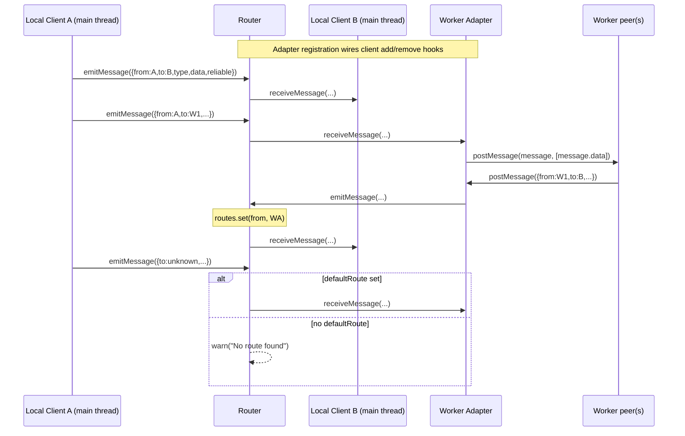
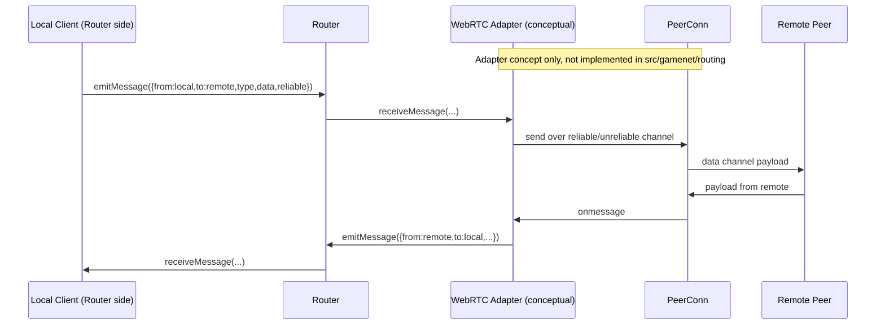

# Routing Architecture

This document describes the routing subsystem in `src/gamenet/routing` and how messages can flow between peers across local and remote boundaries.

## Status at a glance

- **Implemented today**: in-process router, direct local clients, and worker adapters.
- **Conceptual (not implemented yet)**: a WebRTC adapter that bridges remote peers into the same routing model.

## Core module map

- `message.ts`
  - Defines `Message`:
    - `from: string`
    - `to: string`
    - `type: string`
    - `data: ArrayBuffer`
    - `reliable: boolean`
- `client.ts`
  - Defines `Client` with `receiveMessage(...)` and `emitMessage(...)` hooks.
  - `createClient(id)` builds a simple in-process endpoint.
- `adapter.ts`
  - Defines `Adapter` (`Client` + `clientIds` + client lifecycle hooks).
  - `createWorkerAdapter(id, worker)` bridges router messages to a `Worker` via `postMessage` (with transferable `ArrayBuffer`).
- `router.ts`
  - Defines `Router` and `createRouter(id)`.
  - Maintains:
    - `adapters: Map<string, Adapter>`
    - `routes: Map<string, Client>` (client id → direct client or adapter)
    - optional `defaultRoute`.

## Implemented runtime behavior

### 1) Local peers in the same thread (direct clients)

Local peers are registered directly with `registerClient(client)`.

- Router stores `routes.set(client.id, client)`.
- When a client emits (`client.onEmitMessage`), router calls `sendMessage(message)`.
- If `message.to` exists in `routes`, router forwards to that target's `receiveMessage(...)`.
- If no route exists, router forwards to `defaultRoute` if configured; otherwise logs a warning.

### 2) Local peers in a web worker (worker adapter)

Worker-hosted peers are represented through an adapter registered with `registerAdapter(adapter)`.

- Adapter route population:
  - Existing `adapter.clientIds` are inserted into router routes at registration time.
  - `adapter.onClientAdd` and `adapter.onClientRemove` keep route table in sync.
- Router-to-worker direction:
  - Router resolves destination to the worker adapter and calls `adapter.receiveMessage(message)`.
  - `createWorkerAdapter` posts to worker with `worker.postMessage(message, [message.data])`.
- Worker-to-router direction:
  - Worker calls `postMessage(message)` back to main thread.
  - Adapter `worker.onmessage` converts event data to `Message` and calls `adapter.emitMessage(message)`.
  - Router listens to `adapter.onEmitMessage`, updates source route (`message.from -> adapter`), then routes onward.

## Implemented flow diagram (same-thread + worker)

## Conceptual remote-peer bridge via WebRTC (not implemented)

Current host/join runtime (`game_client.ts`, `game_server.ts`, `peer_conn.ts`) exchanges game payloads over WebRTC data channels using `{ t, data }` envelopes. The routing subsystem is currently separate.

A future adapter could bridge these systems by:

- Mapping routing `Message.type` to data-channel envelope `t`.
- Carrying binary payload in `Message.data` and preserving routing `reliable` to choose reliable/unreliable channel.
- Translating inbound WebRTC messages back into routing `Message` and re-injecting via `adapter.emitMessage(...)`.

## Conceptual remote flow diagram (WebRTC adapter)

## Routing decisions and guarantees

- Routing key is destination id (`message.to`).
- Source learning exists for adapters (`message.from` is bound to emitting adapter).
- Reliability is part of the message contract (`reliable: boolean`) and should remain explicit through any transport bridge.
- Router itself does not serialize payloads; transport adapters own wire-format translation.

## Extension points

1. Add new `Adapter` implementations (for example, remote/WebRTC bridge).
2. Use `defaultRoute` as an upstream fallback for unresolved destinations.
3. Add policy checks (authorization, filtering, metrics) at adapter boundaries before forwarding.

## Current limitations

- No built-in adapter for WebRTC in `src/gamenet/routing` today.
- No built-in persistence or retry strategy at router level.
- Route lifecycle for adapter-owned clients depends on adapter hook correctness (`onClientAdd`/`onClientRemove`).
