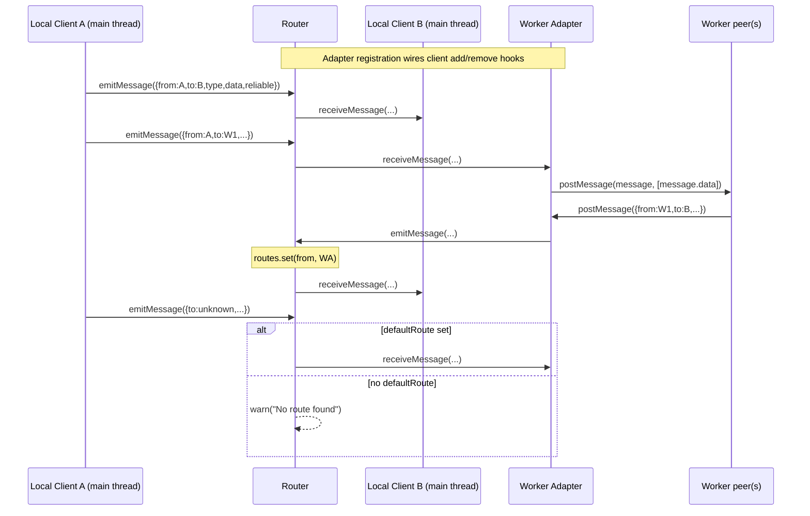
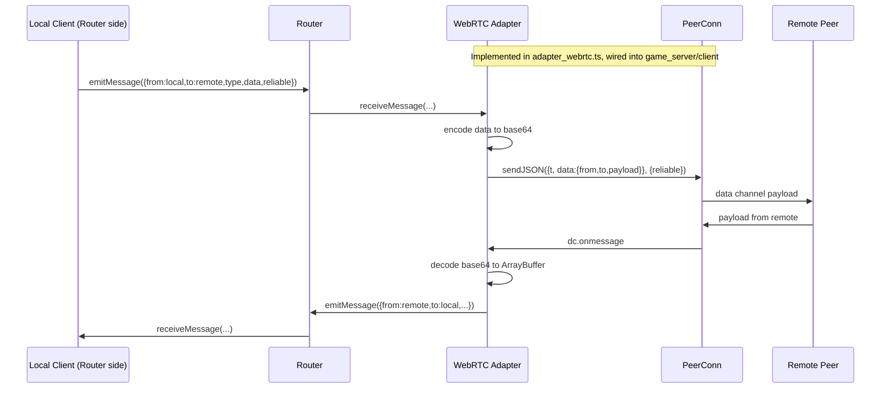

# Routing Architecture

This document describes the routing subsystem in `src/gamenet/routing` and how messages can flow between peers across local and remote boundaries.

## Status at a glance

- **Implemented today**: 
  - In-process router with direct local clients
  - Worker adapter for web worker communication
  - WebRTC adapter for remote peer communication (internal, not publicly exported)
- **Integration status**: WebRTC adapter is wired into `game_server.ts` and `game_client.ts` runtime but not exposed in public API

## Core module map

- `message.ts`
  - Defines `Message`:
    - `from: string`
    - `to: string`
    - `type: string`
    - `data: ArrayBuffer`
    - `reliable: boolean`
- `client.ts`
  - Defines `Client` with `receiveMessage(...)` and `emitMessage(...)` hooks.
  - `createClient(id)` builds a simple in-process endpoint.
- `adapter.ts`
  - Defines `Adapter` (`Client` + `clientIds` + client lifecycle hooks).
  - `createWorkerAdapter(id, worker)` bridges router messages to a `Worker` via `postMessage` (with transferable `ArrayBuffer`).
- `adapter_webrtc.ts`
  - Defines `WebRTCAdapter` extending `Adapter` with `peerConn: PeerConn`.
  - `createWebRTCAdapter(id, remoteId, peerConn)` bridges routing messages to/from WebRTC data channels.
  - `handleIncomingWebRTCMessage(adapter, envelope, reliable)` processes inbound WebRTC messages.
  - **Internal use only**: Not exported from `src/gamenet/index.ts`.
- `router.ts`
  - Defines `Router` and `createRouter(id)`.
  - Maintains:
    - `adapters: Map<string, Adapter>`
    - `routes: Map<string, Client>` (client id → direct client or adapter)
    - optional `defaultRoute`.

## Implemented runtime behavior

### 1) Local peers in the same thread (direct clients)

Local peers are registered directly with `registerClient(client)`.

- Router stores `routes.set(client.id, client)`.
- When a client emits (`client.onEmitMessage`), router calls `sendMessage(message)`.
- If `message.to` exists in `routes`, router forwards to that target's `receiveMessage(...)`.
- If no route exists, router forwards to `defaultRoute` if configured; otherwise logs a warning.

### 2) Local peers in a web worker (worker adapter)

Worker-hosted peers are represented through an adapter registered with `registerAdapter(adapter)`.

- Adapter route population:
  - Existing `adapter.clientIds` are inserted into router routes at registration time.
  - `adapter.onClientAdd` and `adapter.onClientRemove` keep route table in sync.
- Router-to-worker direction:
  - Router resolves destination to the worker adapter and calls `adapter.receiveMessage(message)`.
  - `createWorkerAdapter` posts to worker with `worker.postMessage(message, [message.data])`.
- Worker-to-router direction:
  - Worker calls `postMessage(message)` back to main thread.
  - Adapter `worker.onmessage` converts event data to `Message` and calls `adapter.emitMessage(message)`.
  - Router listens to `adapter.onEmitMessage`, updates source route (`message.from -> adapter`), then routes onward.

## Implemented flow diagram (same-thread + worker)

## Remote peer bridge via WebRTC (implemented, internal)

### Implementation

The WebRTC adapter (`adapter_webrtc.ts`) bridges the routing subsystem with WebRTC data channels used by `game_client.ts`, `game_server.ts`, and `peer_conn.ts`.

**Outbound routing Message → WebRTC**:
- Routing `Message.type` maps to data-channel envelope field `t`
- `Message.data` (ArrayBuffer) is encoded to base64 for JSON transport
- `Message.reliable` selects between reliable/unreliable data channels
- Envelope structure: `{ t: message.type, data: { from, to, payload: base64 } }`

**Inbound WebRTC → routing Message**:
- Envelope `t` becomes `Message.type`
- Base64 `payload` decoded back to ArrayBuffer
- `from` and `to` preserved from envelope
- Channel type (reliable/unreliable) recorded in `Message.reliable`
- Non-routing messages (without routing envelope structure) are ignored

### Integration wiring

**Host side (`game_server.ts`)**:
- Creates `Router` instance per server
- Creates `WebRTCAdapter` for each connected peer
- Registers adapter with router on peer connection
- Data channel handlers check for routing messages via `handleIncomingWebRTCMessage`
- Adapter cleanup on peer disconnect removes routes

**Client side (`game_client.ts`)**:
- Creates `Router` instance per client
- Creates `WebRTCAdapter` for server connection
- Registers adapter with router on connection
- Data channel handlers check for routing messages via `handleIncomingWebRTCMessage`
- Adapter cleanup on disconnect

### Compatibility preservation

- Existing non-routing `{ t, data }` messages continue to work unchanged
- Routing messages use extended envelope: `{ t, data: { from, to, payload } }`
- Detection is structure-based: checks for `from`, `to`, `payload` fields
- No signaling protocol changes required
- Backward compatible with existing game code

## Remote flow diagram (WebRTC adapter - implemented)

## Routing decisions and guarantees

- Routing key is destination id (`message.to`).
- Source learning exists for adapters (`message.from` is bound to emitting adapter).
- Reliability is part of the message contract (`reliable: boolean`) and remains explicit through WebRTC transport.
- Router itself does not serialize payloads; transport adapters own wire-format translation.
- WebRTC adapter uses base64 encoding for ArrayBuffer transport over JSON-based channels.

## Extension points

1. Add new `Adapter` implementations for other transport mechanisms.
2. Use `defaultRoute` as an upstream fallback for unresolved destinations.
3. Add policy checks (authorization, filtering, metrics) at adapter boundaries before forwarding.
4. Export WebRTC adapter from public API when ready for external use.

## Migration and compatibility notes

### Current status (internal integration)

- WebRTC adapter is wired into `game_server.ts` and `game_client.ts` but **not exported** from `src/gamenet/index.ts`
- Router instances are created internally but not exposed through public API
- Existing game code using `Channel.emit()` and `GameClient.emit()` continues to work unchanged
- Routing messages and non-routing messages coexist on the same data channels

### Backward compatibility

- **Signaling handshake**: No changes to join/offer/answer flow
- **Message envelopes**: Routing messages use extended structure; existing `{ t, data }` messages unaffected
- **API surface**: No breaking changes to `hostGame()` or `joinGame()` return types for public API consumers
- **Internal changes**: `GameServer` and `GameClient` interfaces now include `router` and `adapter(s)` fields

### Future work / TODOs

1. **Public API export**: Decide if/when to expose routing API from `src/gamenet/index.ts`
2. **Direct routing access**: Consider exposing `Router` and adapters through `GameServer`/`GameClient` for direct message routing
3. **Binary encoding**: Replace base64 with more efficient binary encoding (e.g., MessagePack, direct ArrayBuffer transfer)
4. **Route discovery**: Add mechanisms for clients to discover other clients' IDs for direct peer-to-peer routing
5. **Multi-hop routing**: Support forwarding messages through intermediate peers
6. **Route metrics**: Track latency and reliability per route for adaptive routing decisions

## Current limitations and known issues

- WebRTC adapter is internal and not publicly accessible via `src/gamenet/index.ts`
- Base64 encoding adds ~33% overhead for binary payloads (future: use more efficient encoding)
- No built-in persistence or retry strategy at router level
- Route lifecycle for adapter-owned clients depends on adapter hook correctness (`onClientAdd`/`onClientRemove`)
- No automatic route discovery mechanism for peer-to-peer communication
- Messages must fit within data channel MTU limits (base64-encoded payload + envelope overhead)
